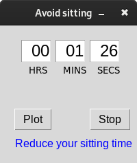

# My first steps learning Python

In this repository I summarize most of the Python code I wrote back in 2018 when I first started to experiment with this language. Little that I know, I will use this language -- and not the one I learned at University (C, C++) -- for work.

# Learn Tk

Avoid sitting

This small app tells you how many minutes you have been sitting. Displaying a warning after 35 minutes. So to remind you to stand up. 

Apparently, sitting for less than 40 minutes does not have big consequences on your health. More on this on a 2nd update.

$ python3.7 avoid_sitting.py 2023/03/28

# Running Environment
Back in 2018 the only working PC I had was this Acer notebook I bought back in 2009, almost 10yrs and operating just fine.

Unfortunately its end came in 2021, it won't start, probably the BIOS battery run out, or something else. The HDD still works though.

- OS: Debian 9
- PC: Sony vaio J-series, previously Acer aspire one Atom Proc/RAM 2GB
- Editor: Emacs
